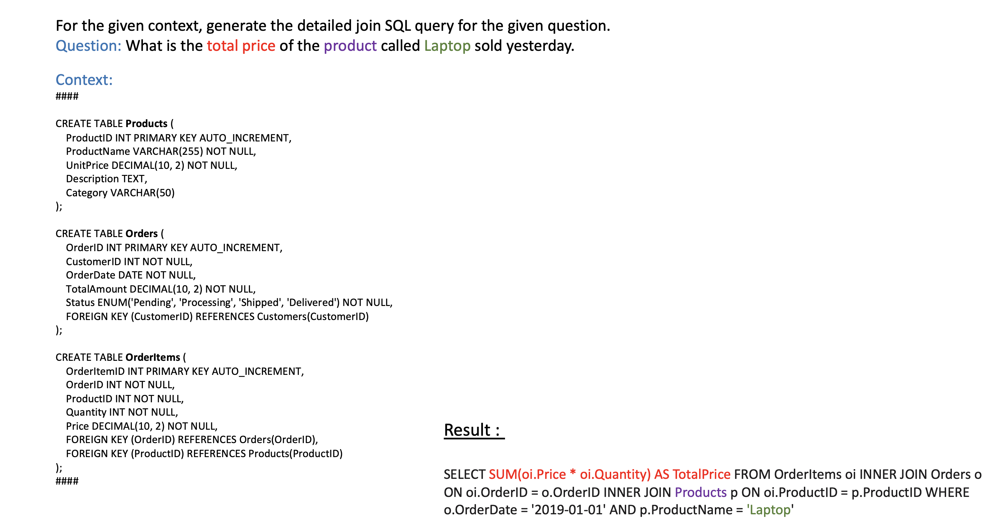
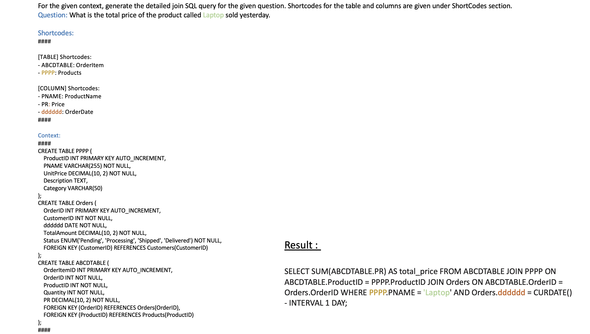
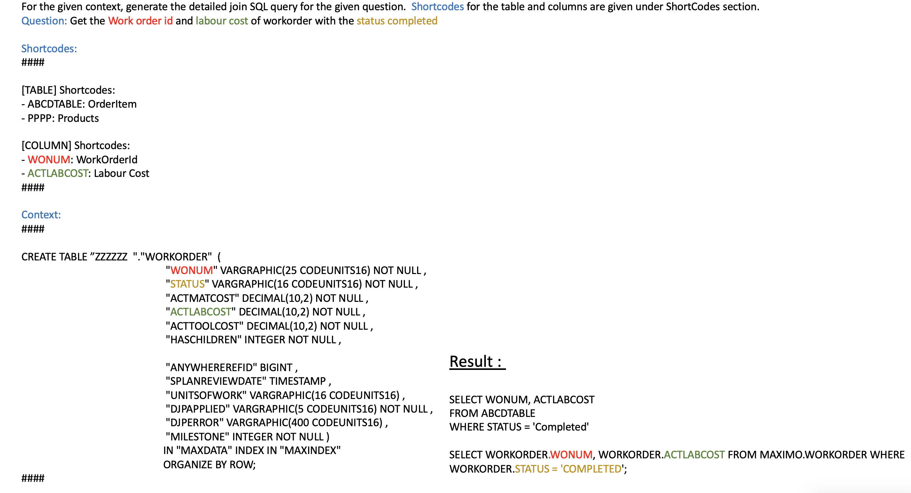
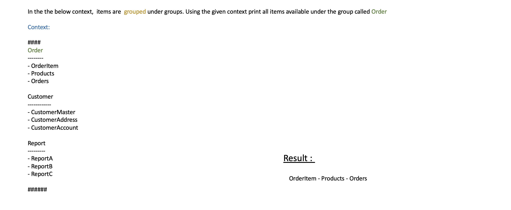

# Sqls in LLM

### Generate Sql by giving the DDL in the Context

The prompt is available [here](./files/01-sql.txt)

### Generate Sql by using ShortCodes

The prompt is available [here](./files/02-sql.txt)

### Generate Sql by using ShortCodes again

The prompt is available [here](./files/03-sql.txt)

### To Retrive items under any group

The prompt is available [here](./files/04-sql.txt)

